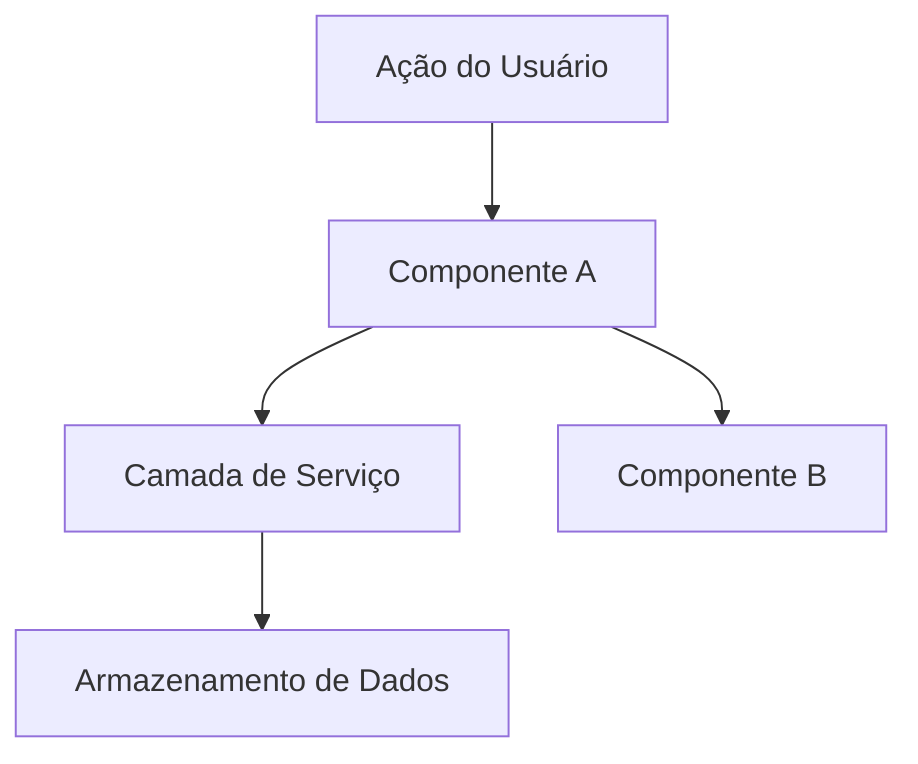

# Fase 2: Design

**Objetivo**: Definir COMO construir. Arquitetura, componentes, o que reutilizar.

## Processo

### 1. Revisar Especificação

Leia `.specs/[feature]/spec.md` antes de desenhar o design.

### 2. Definir Arquitetura

Visão geral de como os componentes interagem. Use diagramas mermaid quando for útil.

### 3. Identificar Reutilização de Código

**CRÍTICO**: Que código existente podemos alavancar? Isso economiza tokens e reduz erros.

### 4. Definir Componentes e Interfaces

Cada componente: Propósito, Localização, Interfaces, Dependências, O que ele reutiliza.

### 5. Definir Modelos de Dados

Se a funcionalidade envolver dados, defina os modelos antes da implementação.

---

## Template: `.specs/[feature]/design.md`

````markdown
# Design de [Funcionalidade]

**Especificação**: `.specs/[feature]/spec.md`
**Status**: Rascunho | Aprovado

---

## Visão Geral da Arquitetura

[Breve descrição da abordagem de arquitetura]


````

---

## Análise de Reutilização de Código

### Componentes Existentes para Alavancar

| Componente              | Localização         | Como Usar                     |
| ----------------------- | ------------------- | ----------------------------- |
| [Componente Existente]  | `src/path/to/file`  | [Estender/Importar/Referenciar] |
| [Utilitário Existente]  | `src/utils/file`    | [Como ele ajuda]              |
| [Padrão Existente]      | `src/patterns/file` | [Aplicar o mesmo padrão]       |

### Pontos de Integração

| Sistema         | Método de Integração                    |
| --------------- | --------------------------------------- |
| [API Existente] | [Como a nova funcionalidade se conecta] |
| [Banco de Dados]| [Como os dados se conectam aos schemas existentes] |

---

## Componentes

### [Nome do Componente]

- **Propósito**: [O que este componente faz - uma frase]
- **Localização**: `src/path/to/component/`
- **Interfaces**:
  - `methodName(param: Type): ReturnType` - [descrição]
  - `methodName(param: Type): ReturnType` - [descrição]
- **Dependências**: [O que ele precisa para funcionar]
- **Reutiliza**: [Código existente sobre o qual este componente é construído]

### [Nome do Componente]

- **Propósito**: [O que este componente faz]
- **Localização**: `src/path/to/component/`
- **Interfaces**:
  - `methodName(param: Type): ReturnType`
- **Dependências**: [Dependências]
- **Reutiliza**: [Código existente]

---

## Modelos de Dados (se aplicável)

### [Nome do Modelo]

```typescript
interface ModelName {
  id: string
  field1: string
  field2: number
  createdAt: Date
}
```

**Relacionamentos**: [Como este se relaciona com outros modelos]

### [Nome do Modelo]

```typescript
interface AnotherModel {
  id: string
  // ...
}
```

---

## Estratégia de Tratamento de Erros

| Cenário de Erro | Tratamento      | Impacto no Usuário |
| --------------- | --------------- | ------------------ |
| [Cenário 1]     | [Como tratado]  | [O que o usuário vê] |
| [Cenário 2]     | [Como tratado]  | [O que o usuário vê] |

---

## Decisões Técnicas (apenas as não óbvias)

| Decisão           | Escolha         | Justificativa |
| ----------------- | --------------- | ------------- |
| [O que decidimos] | [O que escolhemos] | [Por que - breve] |

---

## Dicas

- **Reutilização é rei** - Todo componente deve referenciar padrões existentes
- **Interfaces primeiro** - Defina contratos antes da implementação
- **Mantenha visual** - Diagramas economizam 1000 palavras
- **Pequenos componentes** - Se o componente faz 3+ coisas, divida-o
- **Confirmar antes das Tarefas** - O usuário aprova o design antes de quebrá-lo em tarefas
